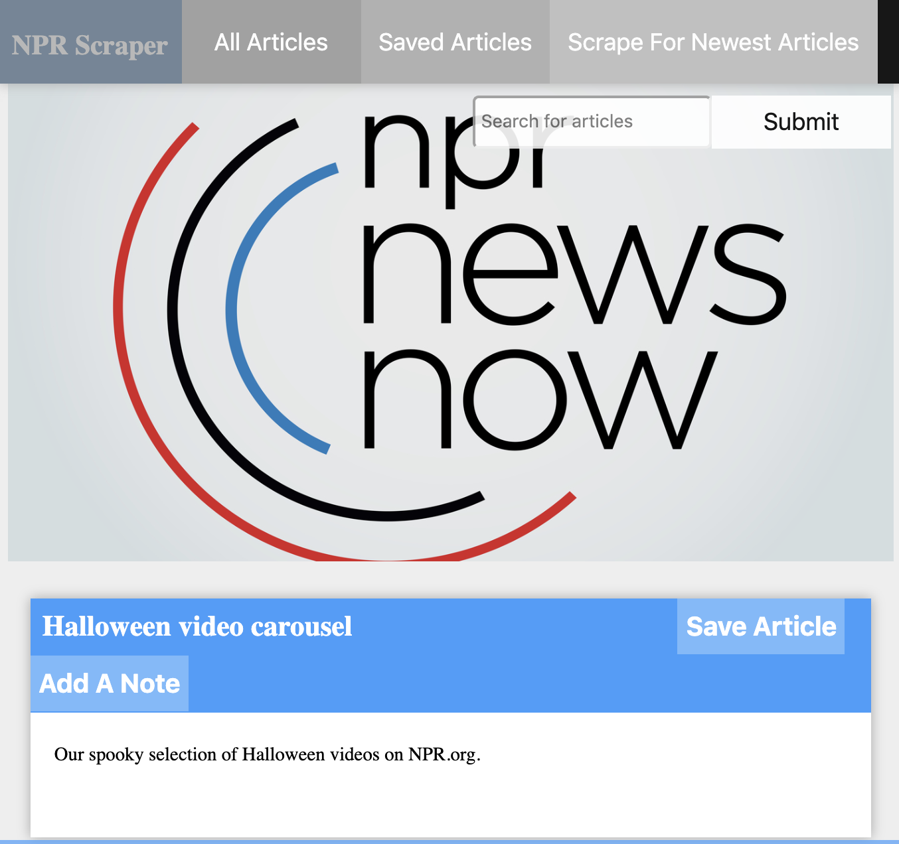

# All-the-News-That-s-Fit-to-Scrape

Overview
The NPR Scraper is a scraper app which captures the title, summary and image of articles of The NPR news. In this app, users are able to save their preferred articles, add notes and edit notes to one or multiple articles. Besides, app also provides search feature, allowing users to search in titles according to different key words.

In this repository, you can see source code of NPR Scraper.

Key Dependencies
request: enables cheerio to get access to front-end code of https://www.npr.org/sections/news/

cheerio: scrapes front-end code from https://www.npr.org/sections/news/

mongoose: be in charge of database of scrap

express: builds server-side routes and functions

morgan: logs server-side requests, helping debugging

express-handlebars: a powerful front-end builder without requiring multiple html pages

Heroku app link:
 https://git.heroku.com/all-the-news-00.git